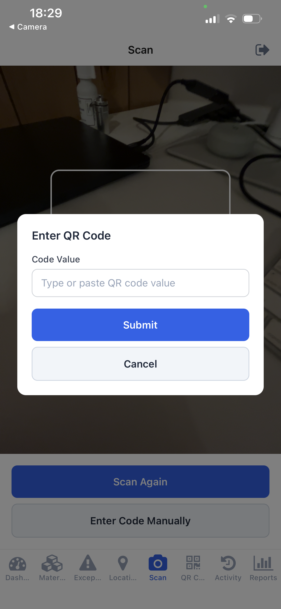
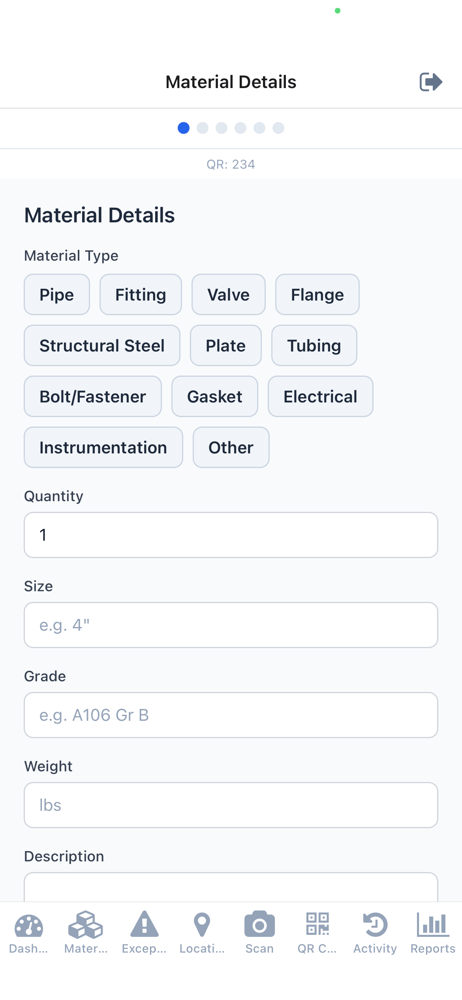
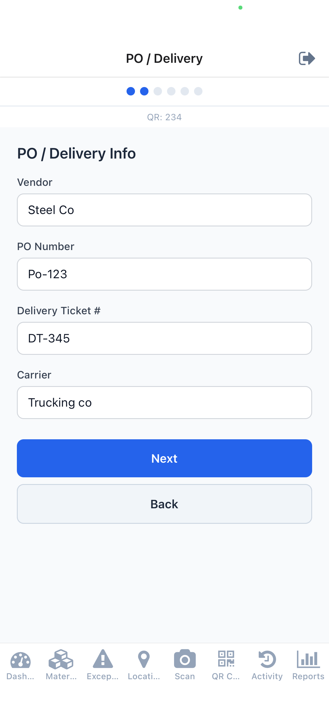
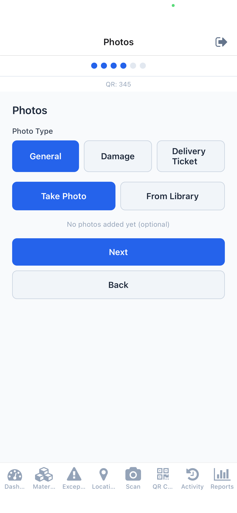
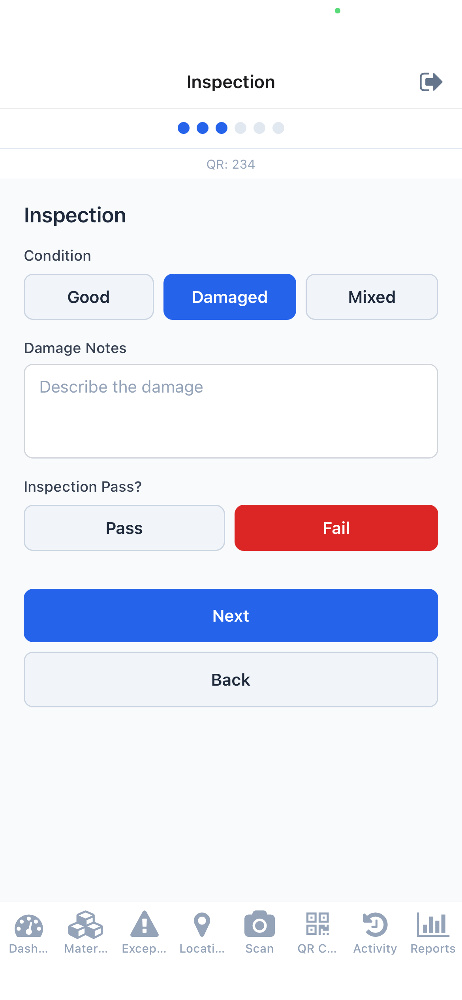
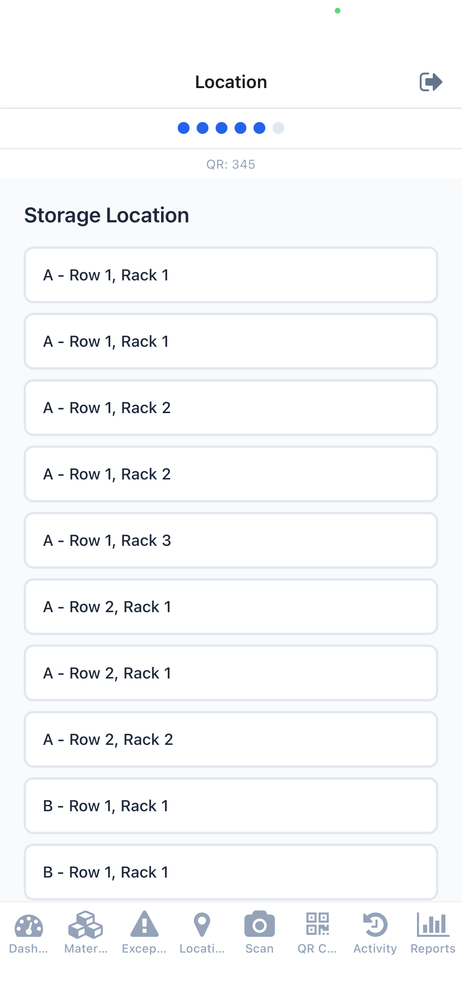

# QR Asset Scanner — Material Management, Simplified

## The Problem

Laydown yards lose time and money to manual tracking. Clipboards, spreadsheets, and radio calls lead to:

- **Lost materials** — items received but never logged, or logged but can't be found
- **Missed exceptions** — damaged or wrong shipments slip through without documentation
- **No audit trail** — when a vendor dispute or insurance claim comes up, there's no proof
- **Delayed decisions** — office staff don't know what's happening in the yard until end of day

## The Solution

A mobile app that puts real-time inventory control in your team's hands. Every material is tracked from the moment it arrives to the moment it ships out.

**Receive &rarr; Inspect &rarr; Store &rarr; Transfer &rarr; Issue &rarr; Ship**

Works on any iPhone or Android — no special hardware required. Just scan a QR code.

---

## How It Works

### Scan to Start

Field workers scan a QR label on arriving material to kick off receiving. Manual entry is available as a fallback.

### Guided Receiving Wizard

A step-by-step form walks the user through the full receiving process — no training manual needed.

**Material Details** — Type, quantity, size, grade, and weight:

**PO / Delivery** — Link to a purchase order, vendor, and delivery info:

**Photo Documentation** — Capture photos of the delivery, materials, and any damage on the spot:

**Inspection** — Record condition, flag discrepancies, and note damage:

**Storage Location** — Assign the material to a yard zone, row, and rack:

### Office Dashboard

Managers get a real-time overview without leaving their desk — KPIs, inventory breakdown by type, and yard status at a glance.

### Exception Management

When a field worker flags a problem (wrong count, wrong type, damage), it goes straight to the exceptions queue. Office staff review the details and resolve with Hold or Return to Vendor.

### Reports and Export

Inventory and aging reports with one-tap CSV export for accounting, audits, or vendor negotiations.

---

## Key Capabilities

| Capability | Description |
|---|---|
| **QR Code Scanning** | Scan to receive, transfer, issue, or ship any material |
| **Photo Documentation** | Capture and attach photos during inspection — general, damage, delivery ticket |
| **Exception Tracking** | Flag problems immediately; office staff get a dedicated review queue |
| **Location Management** | Organize the yard by zones, rows, and racks — always know where materials are |
| **QR Label Printing** | Generate and print QR labels in batches, directly from the app |
| **Inventory Search** | Filter materials by status, type, or location — find anything in seconds |
| **Offline Support** | Works without cell service — actions queue up and sync when connectivity returns |
| **Role-Based Access** | Field workers see what they need; office staff get the full management suite |
| **Audit-Ready Records** | Every receive, transfer, issue, and shipment is logged with timestamps and user info |
| **CSV Export** | Export inventory and aging reports for external systems |

---

## Two User Roles

### Field Workers
- Scan QR codes to receive, transfer, issue, or ship materials
- Complete the guided receiving wizard with photos and inspection
- Browse inventory and activity from their phone
- Work offline when yard connectivity is limited

### Office Staff / Admins
Everything field workers can do, plus:
- Dashboard with KPIs and yard overview
- Full material management (search, filter, edit)
- Exception review and resolution
- Location management
- QR code generation and label printing
- Inventory and aging reports with CSV export

---

## Deployment

- **iPhone and Android** — one app, both platforms
- **Your data stays yours** — dedicated database per client, fully isolated
- **No per-user fees** — 5 users or 500, same cost
- **Fast setup** — your team can be live in days, not months

---

## What's Next

Features on the near-term roadmap:

- **Photo Gallery** — View inspection photos from any material or exception detail screen
- **Push Notifications** — Real-time alerts when exceptions are flagged or materials age past thresholds
- **User Management** — Admins add and remove team members directly in the app
- **Cycle Counts** — Verify physical inventory against the system with guided count workflows

---

*Ready to see it in action? We can set up a live demo on your team's phones in minutes.*
